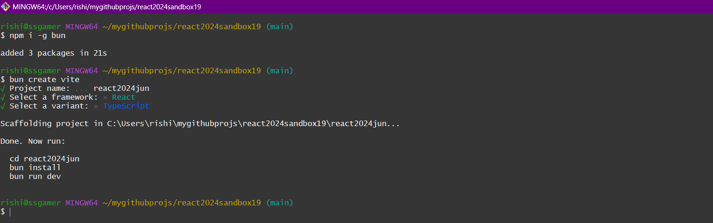
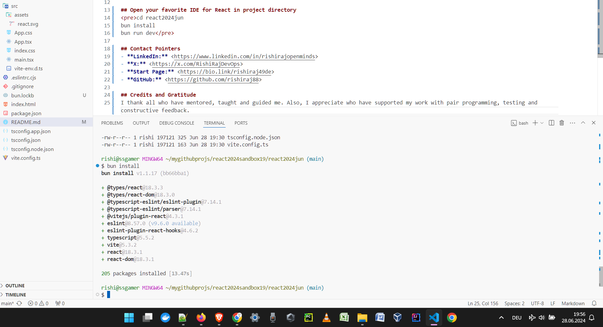
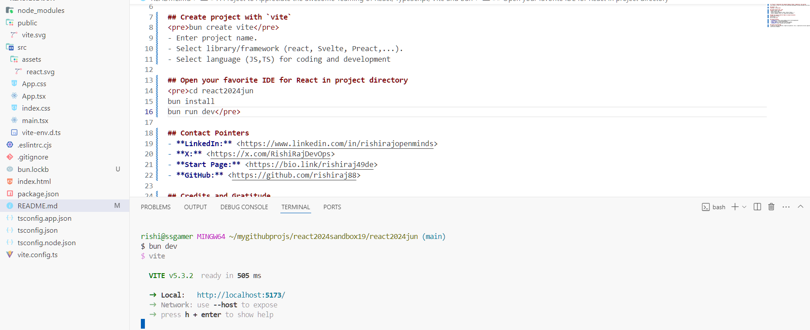
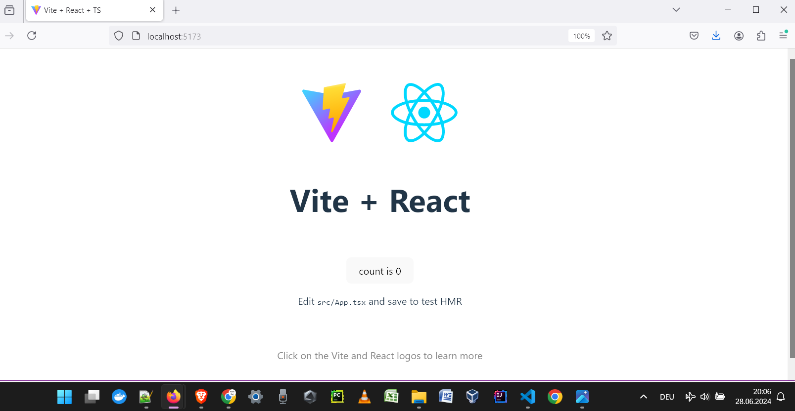

# A Project to Appreciate the awesome Teaming of React, TypeScript, Vite and Bun
This project is built to appreciate the accelerated development tooling available with Vite and Bun for React.js.

## Install `bun`
<pre>npm i -g bun</pre>

## Create project with `vite`
<pre>bun create vite</pre>

- Enter project name.
- Select library/framework (react, Svelte, Preact,...).
- Select language (JS,TS) for coding and development

## Open your favorite IDE for React in project directory
<pre>cd react2024jun
bun install
bun run dev</pre>

- See the build duration. Amazingly short, yes?! The word `run` may be skipped for running the project fro development:
<pre>bun dev</pre>

- Are you as well impressed by the super-quick startup of the project?

## And the app is live!

## Contact Pointers
- **LinkedIn:** <https://www.linkedin.com/in/rishirajopenminds>
- **X:** <https://x.com/RishiRajDevOps>
- **Start Page:** <https://bio.link/rishiraj49de>
- **GitHub:** <https://github.com/rishiraj88>

## Credits and Gratitude
I thank all who have mentored, taught and guided me. Also, I appreciate who have supported my work with pair programming, testing and constructive feedback.
